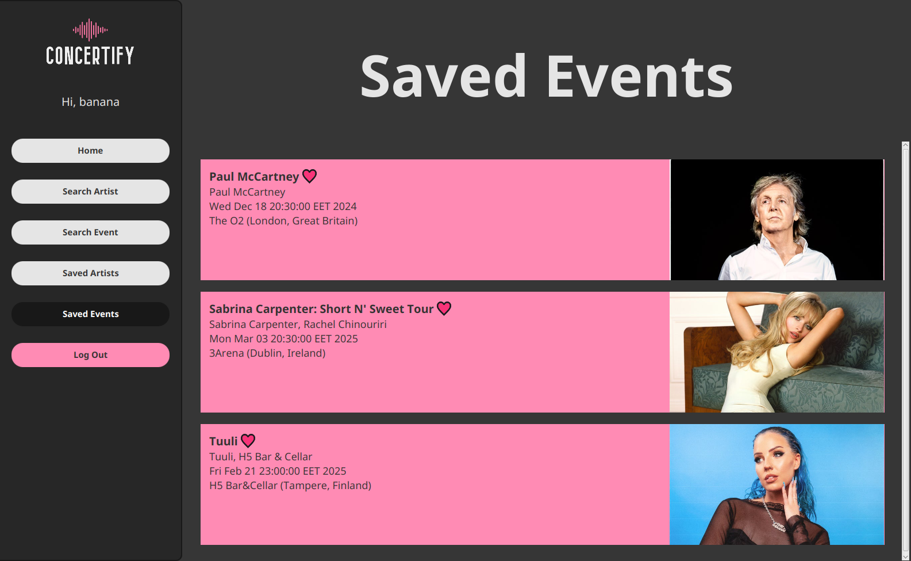

# Concertify

_Group assignment for the course COMP.SE.110-2024-2025-1 (Software Design) at
Tampere University._

Concertify is a desktop application for finding events for your favorite
musical artists.



## Installation

### Prerequisites

Make sure that the following software are installed before proceeding:

- [Java](https://www.oracle.com/java/technologies/javase-jdk17-downloads.html) - JDK 17 or higher
- [Apache Maven](https://maven.apache.org/download.cgi) - version 3.9.0 or higher

Concertify runs on all major operating systems.

### Install and run

After cloning the repository (or extracting it from the zip archive) navigate
to the `concertify/` directory

```
cd tranquil/concertify

```

then build and run the project

```
mvn clean javafx:run
```

## Usage

### Saving an artist

1. Go to _Search Artists_
2. Search for the artist
3. Click the heart icon on the artist card

### Saving an event

1. Go to _Saved Artists_
2. Click on an artist
3. Click _Artist's Events_
4. Click the heart icon on one of the events

Alternatively:

1. Go to _Search Event_
2. Search for a city (optionally you can specify the country)
3. Click the heart icon on one of the events

### ConcertiMap

The _Home_ page shows a map where you can see the location of

- events you saved
- events by your saved artists
- events in the city you last searched for

### Statistics

You can find listening statistics for

- top artists worldwide on the _Search Artist_ page
- top artists in a single country on the _Search Event_ page
- a single artist on the artist's page under _Artist Statistics_

Listening data is provided by the users of [Last.fm](https://www.last.fm/home),
who are tracking their music listening habits with the service, therefore the
data is not representative of the whole population.

### Switching users

1. Click _Log Out_
2. Switch to the singup page by clicking _Sign up now!_
3. Provide your credentials and click _Sign up_

## Design document

The design document can be found in the root directory of the project in pdf
format.

## Running unit tests

Run unit tests from the `concertify/` directory with the following command:

```
mvn test
```

## Generating Javadoc documentation

Javadoc documentation for the application can be generated with the following command:

```
mvn javadoc:javadoc
```

The generated Javadoc is a HTML file located at `/target/site/apidocs/index.html`
